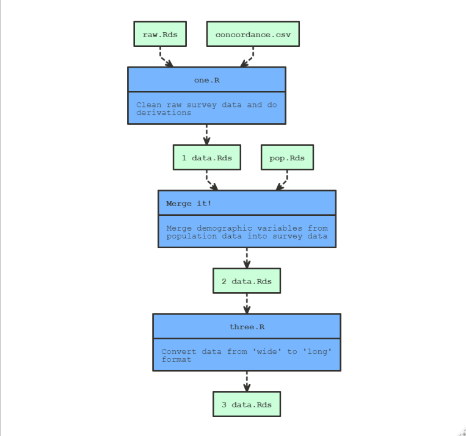
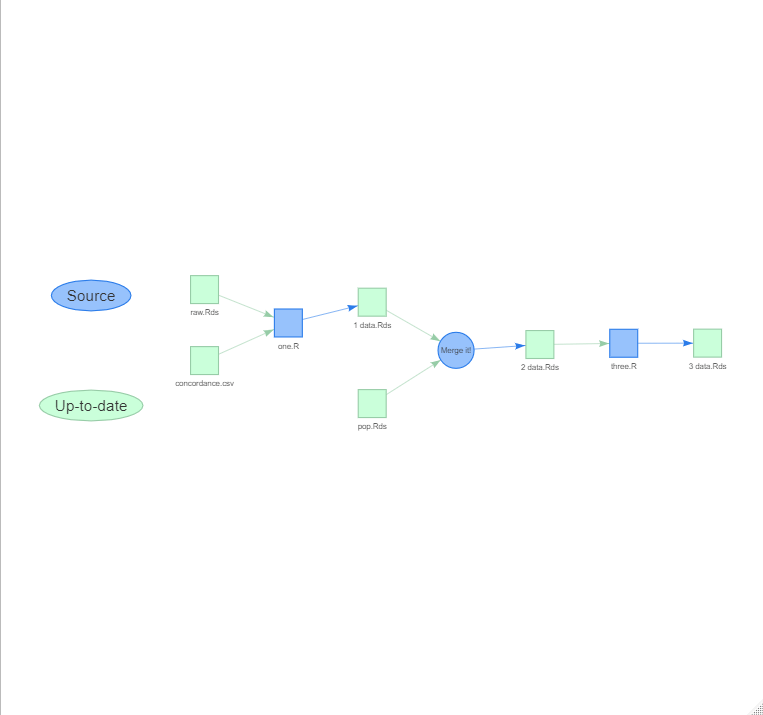
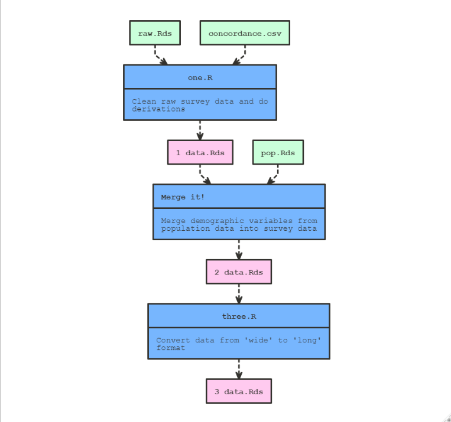

<!-- README.md is generated from README.Rmd. Please edit that file -->

```{r, include = FALSE}
knitr::opts_chunk$set(
  collapse = TRUE,
  comment = "#>",
  fig.path = "man/figures/README-",
  out.width = "100%"
)
```

# makepipe 

<!-- badges: start -->
[](https://app.codecov.io/gh/kinto-b/makepipe?branch=master)
[](https://github.com/kinto-b/makepipe/actions)
[](https://CRAN.R-project.org/package=makepipe)
<!-- badges: end -->

The goal of `makepipe` is to allow for the construction of make-like pipelines in R with very minimal overheads. In contrast to `targets` (and its predecessor `drake`) which offers an opinionated pipeline framework that demands highly functionalised code, `makepipe` is easy-going, being adaptable to a wide range  of data science workflows.

A minimal example can be found here: https://github.com/kinto-b/makepipe_example

## Installation

You can install the released version of `makepipe` from [CRAN](https://CRAN.R-project.org) with:

``` r
install.packages("makepipe")
```

And the development version from [GitHub](https://github.com/) with:

``` r
# install.packages("devtools")
devtools::install_github("kinto-b/makepipe")
```


## Building a pipeline

To construct a pipeline, one simply needs to chain together a number of  `make_with_*()` statements. When the pipeline is run through, each  `make_with_*()` block is evaluated if and only if the `targets` are out-of-date  with respect to the `dependencies` (and `source` file). But, whether or not the block is evaluated, a segment will be added to the Pipeline object behind the scenes. At the end of the script, once the entire pipeline has been run  through, one can display the accumulated Pipeline object to produce a flow-chart visualisation of the pipeline. For example:

``` r
make_with_source(
  note = "Clean raw survey data and do derivations",
  source = "one.R",
  targets = "data/1 data.Rds",
  dependencies = c("data/raw.Rds", "lookup/concordance.csv")
)

make_with_recipe(
  label = "Merge it!",
  note = "Merge demographic variables from population data into survey data",
  recipe = {
    dat <- readRDS("data/1 data.Rds")
    pop <- readRDS("data/pop.Rds")
    merged_dat <- merge(dat, pop, by = "id")
    saveRDS(merged_dat, "data/2_data.Rds")
  },
  targets = c("data/2 data.Rds"),
  dependencies = c("data/1 data.Rds", "data/pop.Rds")
)

make_with_source(
  note = "Convert data from 'wide' to 'long' format",
  source = "three.R",
  targets = "data/3 data.Rds",
  dependencies = "data/2 data.Rds"
)

show_pipeline()
```

```{r out.width = "75%", echo = FALSE, fig.align = "center"}

```

We can also get an interactive visNetwork widget:

```r
show_pipeline(as = "visnetwork")
```

```{r out.width = "75%", echo = FALSE, fig.align = "center"}

```

Once you've constructed a pipeline, you can 'clean' it (i.e. delete all registered targets): 

```r
p <- get_pipeline()
p$clean()
```

Then, when you look again at the visualisation, the target nodes will be red not green since they're out-of-date:

```r
show_pipeline()
```

```{r out.width = "75%", echo = FALSE, fig.align = "center"}

```

And then you can 'rebuild' to re-execute the entire pipeline and re-create the cleaned targets:

```r
p <- get_pipeline()
p$build()
```

