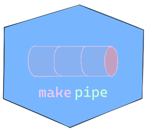
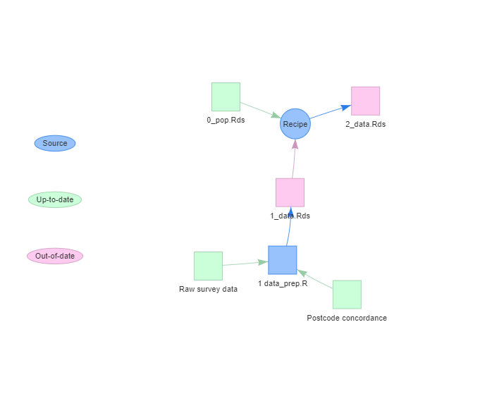

<!-- README.md is generated from README.Rmd. Please edit that file -->

# piper 

<!-- badges: start -->
<!-- badges: end -->

The goal of `piper` is to allow for the construction of make-like
pipelines in R with very minimal overheads. In contrast to `targets`
(and its predecessor `drake`) which offers an opinionated pipeline
framework that demands highly functionalised code, `piper` is catholic
in approach, being adaptable to a wide range of data science workflows.

## Installation

You can install the development version from
[GitHub](https://github.com/) with:

``` r
# install.packages("devtools")
devtools::install_github("kinto-b/piper")
```

## Building a pipeline

To construct a pipeline, one simply needs to chain together a number of
`make_with_*()` statements. When the pipeline is run through, each
`make_with_*()` block is evaluated if and only if the `targets` are
out-of-date with respect to the `dependencies` (and `source` file). But,
whether or not the block is evaluated, a segment will be added to the
Pipeline object behind the scenes. At the end of the script, once the
entire pipeline has been run through, one can display the accumulated
Pipeline object to produce a flow-chart visualisation of the pipeline.
For example:

``` r
library(piper)
make_with_source(
  dependencies = c("scratch/data/0_raw_data.csv", "scratch/lookup/concordance.csv"),
  source = c("scratch/1 data_prep.R"),
  targets = c("scratch/data/1_data.Rds")
)
make_with_recipe(
    dependencies = c("scratch/data/1_data.Rds", "scratch/data/0_pop.Rds"),
    recipe = {
      usethis::ui_info("Merging...")
    },
    targets = c("scratch/data/2_data.Rds")
)
show_pipeline(labels = c(
  "scratch/lookup/concordance.csv" = "Postcode concordance",
  "scratch/data/0_raw_data.csv" = "Raw survey data"
))
```


